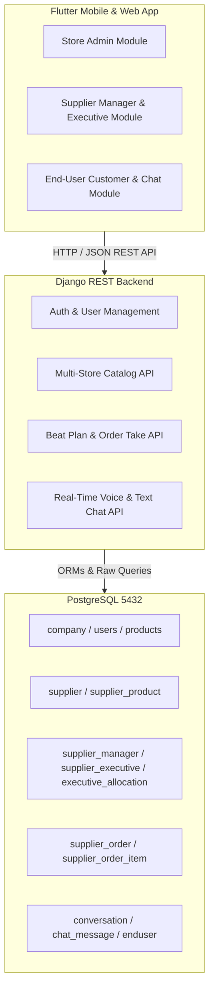
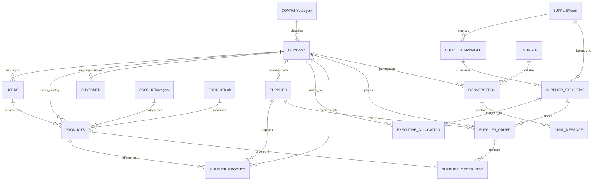

# Complete System Architecture & Data Blueprint

> [!NOTE]
> This document serves as the master technical blueprint for the **B2B Product Catalog, Multi-Store Supply Chain & Sales Force Automation Platform**. It covers the complete PostgreSQL relational database schema, multi-store multi-supplier connectivity rules, sales executive beat plan workflows, full login credentials directory, live catalog data mapping, REST API endpoints, and Flutter client screen architecture.

---

## 1. System Overview & Technology Stack



### Core Stack Specs
- **Backend Framework**: Django 5.1 / Python 3.13 (REST API service running at `http://127.0.0.1:8000`)
- **Database Engine**: PostgreSQL 16 (`mydb` hosted at `localhost:5432`, `USER: postgres`, `PASS: root`)
- **Mobile/Web Frontend**: Flutter 3.x (`d:\app1\lib`)
- **Media Assets Storage**: Django local media root (`/media/` for product images and chat audio recordings)

---

## 2. PostgreSQL Relational Database Schema

The database consists of **18 tables** structured around multi-tenant retail stores, B2B wholesale suppliers, field sales force allocations, and customer ordering.

### Entity Relationship & Dependency Architecture



---

### Complete Table Specifications

#### 1. `company` (Retail Stores / Tenants)
Stores physical retail businesses (e.g. Supermarkets, Mobile Shops, Bakeries).
- `companyid` (AutoField, PK): Unique store identifier.
- `companyname` (VARCHAR 200): Store display name.
- `companyphonenumber` (BIGINT): Contact phone.
- `companylocation` (VARCHAR 200): GPS coordinates (e.g. `'10.513205, 76.197028'`).
- `companyaddress` (TEXT): Full physical address.
- `categoryid` (FK -> `companycategory.categoryid`): Store sector.

#### 2. `users` (Store Admin Login Accounts)
Store-level admin accounts used to log in to the Store Portal in Flutter.
- `userid` (AutoField, PK): User ID.
- `username` (VARCHAR 120): Login username.
- `useremail` (VARCHAR 200, Unique): Login email.
- `userpassword` (VARCHAR 120): Plain/hashed password.
- `companyid` (FK -> `company.companyid`): Store association.

#### 3. `companycategory`
- `categoryid` (AutoField, PK)
- `categoryname` (VARCHAR 30): e.g. Bakery, Mobile & Electronics, Stationary.

#### 4. `productcategory`
- `productcategoryid` (AutoField, PK)
- `productcategoryname` (VARCHAR 100): e.g. Grains & Pulses, Bakery, Personal Care.

#### 5. `productunit`
- `productunitid` (AutoField, PK)
- `productunitname` (VARCHAR 50): e.g. Pcs, Kg, Litre, Packet, Box.

#### 6. `products` (Master Store Product Catalog)
Catalog of items listed under retail stores.
- `productid` (AutoField, PK): Product ID.
- `productname` (VARCHAR 150): Item title.
- `productcategoryid` (FK -> `productcategory`): Item category.
- `productunitid` (FK -> `productunit`): Measurement unit.
- `productprice` (DECIMAL 18,2): Standard retail price.
- `productphotopath` (VARCHAR 2000): Image path relative to media root.
- `dateadded` (DATE): Date added.
- `userid` (FK -> `users`): Store admin who added product.
- `companyid` (FK -> `company`): Store owner.
- `addtype` (VARCHAR 10): `'Single'` or `'Multi'`.

#### 7. `supplier` (Store-Connected B2B Suppliers)
Links wholesale supplier records to specific retail stores.
- `supplierid` (AutoField, PK): Supplier ID.
- `suppliername` (VARCHAR 200): Business name.
- `supplierphonenumber` (VARCHAR 20): Contact phone.
- `supplieraddress` (VARCHAR 500): Office address.
- `supplieremail` (VARCHAR 200): Email.
- `suppliergst` (VARCHAR 50): GSTIN Tax ID (used to match across stores).
- `isconnected` (SMALLINT): `1` if connected, `0` if disconnected.
- `companyid` (FK -> `company`): Associated store.

#### 8. `supplieruser` (Onboarded B2B Supplier Login Accounts)
Master logins for wholesale suppliers.
- `supplieruserid` (AutoField, PK)
- `supplierid` (FK -> `supplier`): Primary supplier link.
- `suppliername` (VARCHAR 25): Supplier entity name.
- `supplierusername` (VARCHAR 25): Login username.
- `supplieruserphone` (VARCHAR 20): Phone.
- `supplieruseremail` (VARCHAR 30): Email.
- `supplierusergstnumber` (VARCHAR 50): GSTIN.
- `supplieruserpassword` (VARCHAR 100): Password.

#### 9. `supplier_product` (Wholesale Price & Multi-Supplier Link Matrix)
Maps which wholesale suppliers provide specific products to stores and at what wholesale price.
- `id` (AutoField, PK)
- `companyid` (FK -> `company`): Store receiving the offer.
- `supplierid` (FK -> `supplier`): Supplier making the offer.
- `productid` (FK -> `products`): Catalog product.
- `supplier_price` (DECIMAL 18,2): Specific wholesale offer price.
- `is_active` (BOOLEAN): Active status toggle.

#### 10. `supplier_manager` (Supplier Field Sales Managers)
- `manager_id` (AutoField, PK)
- `supplier_user_id` (FK -> `supplieruser`): Supplier company.
- `manager_name` (VARCHAR 100): Manager name.
- `manager_username` (VARCHAR 100, Unique): Login username.
- `manager_password` (VARCHAR 100): Password.
- `manager_phone` (VARCHAR 20): Phone.
- `manager_area` (VARCHAR 100): Territory area.

#### 11. `supplier_executive` (Supplier Sales Executives)
Field agents taking orders from retail stores on beat plans.
- `executiveid` (AutoField, PK)
- `manager_id` (FK -> `supplier_manager`): Direct reporting manager.
- `supplier_user_id` (FK -> `supplieruser`): Supplier parent company.
- `executive_name` (VARCHAR 100): Executive name.
- `executive_username` (VARCHAR 100, Unique): Login username.
- `executive_password` (VARCHAR 100): Password.
- `executive_phone` (VARCHAR 20): Phone.

#### 12. `executive_allocation` (Beat Plan Allocation Table)
Allocates sales executives to visit specific retail stores.
- `allocation_id` (AutoField, PK)
- `executive_id` (FK -> `supplier_executive`): Assigned executive.
- `company_id` (FK -> `company`): Store to visit.

#### 13. `supplier_order` (Master B2B Purchase Orders)
- `order_id` (AutoField, PK)
- `companyid` (FK -> `company`): Store receiving order.
- `supplierid` (FK -> `supplier`): Supplier receiving order.
- `executive_id` (FK -> `supplier_executive`, Nullable): Executive who booked the order.
- `total_amount` (DECIMAL 18,2): Total order value.
- `status` (VARCHAR 50): `'Pending'`, `'Approved'`, `'Delivered'`.
- `gps_latitude` (DECIMAL 10,7): Booking location latitude.
- `gps_longitude` (DECIMAL 10,7): Booking location longitude.
- `created_at` (TIMESTAMP): Booking timestamp.

#### 14. `supplier_order_item` (Order Line Items)
- `item_id` (AutoField, PK)
- `order_id` (FK -> `supplier_order`): Parent order.
- `productid` (FK -> `products`): Product booked.
- `quantity` (INT): Quantity ordered.
- `price_at_order` (DECIMAL 18,2): Agreed unit price at booking.

#### 15. `enduser` (End-Consumers for Chat & Direct Orders)
- `endsuerid` (AutoField, PK)
- `endusername` (VARCHAR 100, Unique): Consumer username.
- `enduserpassword` (VARCHAR 100): Consumer password.
- `enduseremail` (VARCHAR 100): Email.
- `enduserphone` (VARCHAR 20): Phone.

#### 16. `conversation` & 17. `chat_message` (Customer Support & Audio Ordering)
- `conversation`: Tracks customer-to-store chat sessions (`companyid`, `endsuerid`).
- `chat_message`: Text messages, audio voice notes (`audio_file`, `duration`, `waveform`), and order statuses (`order_status`: `'pending'`, `'approved'`, `'rejected'`).

---

## 3. Multi-Store & Multi-Supplier Technical Logic

### A. Multi-Store Supplier Matching via GSTIN
In B2B supply chains, one wholesale supplier (e.g. **ABC Traders**) sells to multiple retail stores (**AN Gallery**, **Navas Bakers**).
- To link them across different store tenant records in `supplier`, the system uses `supplier.suppliergst` matching.
- When an executive from `abctraders` logs in, Django queries all `supplier` records matching `suppliergst == '32ABCDE1234F1Z1'`. This exposes all stores allocated to that executive.

### B. Single vs Multi-Supplier Pricing Logic
- **Single Supplier Setup**: A product has exactly 1 entry in `supplier_product`.
- **Multi-Supplier Setup**: A product has multiple active entries in `supplier_product` for the same store from different suppliers.
  - *Example*: Product `Fresh Milk Bread 400g` at **Navas Bakers** (Company ID #2):
    - **ABC Traders** (Supplier #1): Wholesale ₹38.50
    - **Malabar Flour & Bakery Goods** (Supplier #3): Wholesale ₹40.00
    - **Royal Dairy & Agro Industries** (Supplier #4): Wholesale ₹42.00
- **Wholesale Price Selection**: When an executive books an order, the system automatically pulls the exact `supplier_price` for that executive's supplier company from `supplier_product`.

---

## 4. Master User Credentials Directory

> [!IMPORTANT]
> All passwords across all accounts in the development environment are set to **`1234`**.

### A. Store Admin Accounts (`users` Table)
| Store ID | Store Name | Category | Login Username | Password | Phone |
| :--- | :--- | :--- | :--- | :--- | :--- |
| **#1** | AN Gallery | Mobile & Electronics | `angallery` | `1234` | 8078923591 |
| **#2** | Navas Bakers | Bakery | `navas` | `1234` | 8078923592 |
| **#3** | AI Supermart | Stationary | `alsuper` | `1234` | 8078923593 |
| **#4** | Western Mart | Bakery | `western` | `1234` | 8078923594 |
| **#6** | Calvino Mart | Stationary | `calvino` | `1234` | 8078923595 |

### B. Onboarded Supplier Accounts (`supplieruser` Table)
| SuppUser ID | Supplier Business Name | Login Username | Password | GSTIN | Phone |
| :--- | :--- | :--- | :--- | :--- | :--- |
| **#1** | ABC Traders | `abctraders` | `1234` | `32ABCDE1234F1Z1` | 9876543210 |
| **#2** | Malabar Flour & Bakery Goods | `malabarbakers` | `1234` | `32ABCDE1234F1Z3` | 9876543212 |
| **#3** | Kerala Grains & Pulses Wholesale | `keralagrains` | `1234` | `32ABCDE1234F1Z5` | 9876543214 |
| **#4** | Metro Confectionery & Sweets | `metrosweets` | `1234` | `32ABCDE1234F1Z7` | 9876543216 |
| **#5** | GreenCare Household Hygiene | `greencare` | `1234` | `32ABCDE1234F1Z9` | 9876543218 |

### C. Supplier Managers (`supplier_manager` Table)
| Manager ID | Manager Name | Login Username | Password | Supplier Company | Phone | Area |
| :--- | :--- | :--- | :--- | :--- | :--- | :--- |
| **#1** | abcmanager | `abcmanager` | `1234` | ABC Traders | 8045253690 | Kunnamkulam |
| **#2** | keralamanager | `keralamanager` | `1234` | Kerala Grains & Pulses Wh | 5252523690 | Kunnamkulam |
| **#3** | malabarmanager | `malabarmanager` | `1234` | Malabar Flour & Bakery Go | 804523569 | Thrissur |
| **#4** | metromanager | `metromanager` | `1234` | Metro Confectionery & Swe | 45273690 | Kannipayor |
| **#5** | greenmanager | `greenmanager` | `1234` | GreenCare Household Hygie | 5427369058 | Pengamuck |

### D. Sales Executives & Beat Allocations (`supplier_executive` Table)
| Exec ID | Executive Name | Login Username | Password | Manager | Supplier Company | Allocated Retail Stores |
| :--- | :--- | :--- | :--- | :--- | :--- | :--- |
| **#1** | **abcexe** | `abcexe` | `1234` | abcmanager | ABC Traders | AN Gallery (#1), Navas Bakers (#2) |
| **#2** | **keralaexe** | `keralaexe` | `1234` | keralamanager | Kerala Grains & Pulses Wh | AI Supermart (#3) |
| **#3** | **malabarexe** | `malabarexe` | `1234` | malabarmanager | Malabar Flour & Bakery Go | Navas Bakers (#2) |
| **#4** | **metroexe** | `metroexe` | `1234` | metromanager | Metro Confectionery & Swe | Western Mart (#4) |
| **#5** | **greenexe** | `greenexe` | `1234` | greenmanager | GreenCare Household Hygie | Calvino Mart (#6) |

### E. End-User Consumer Accounts (`enduser` Table)
| Consumer ID | Username | Password | Phone | Email |
| :--- | :--- | :--- | :--- | :--- |
| **#1** | `ajil321` | `1234` | 8045326980 | ajil321@gmail.com |
| **#2** | `Goutham` | `1234` | 7306616715 | gouthamtktkt@gmail.com |
| **#3** | `rahul` | `1234` | 8045235690 | raa.com |

---

## 5. Live Product Catalogs & Wholesale Pricing Map

### 📱 Store 1: AN Gallery (Company ID #1)
| Product ID | Product Name | Category | Unit | Retail Price | Supplying Supplier | Wholesale Price |
| :--- | :--- | :--- | :--- | :--- | :--- | :--- |
| **#2** | Wireless Earbuds Pro | Mobile & Electronics | Pcs | ₹1,999.00 | ABC Traders | ₹1,839.08 |
| **#3** | Fast Charging Cable Type-C | Mobile & Electronics | Pcs | ₹299.00 | Global Electronics Supplies | ₹275.08 |
| **#4** | Bluetooth Mini Speaker | Mobile & Electronics | Pcs | ₹899.00 | Global Electronics Supplies | ₹827.08 |
| **#5** | Executive Leather Notebook | Stationary | Pcs | ₹350.00 | ABC Traders | ₹322.00 |
| **#6** | Ergonomic Gel Pen Set (Pack of 5) | Stationary | Box | ₹150.00 | ABC Traders | ₹138.00 |

### 🥖 Store 2: Navas Bakers (Company ID #2)
| Product ID | Product Name | Category | Unit | Retail Price | Supplying Suppliers | Wholesale Prices | Setup Type |
| :--- | :--- | :--- | :--- | :--- | :--- | :--- | :--- |
| **#7** | Fresh Milk Bread 400g | Bakery | Packet | ₹45.00 | • ABC Traders<br>• Malabar Flour & Bakery Goods<br>• Royal Dairy & Agro Industries | ₹38.50<br>₹40.00<br>₹42.00 | **Multi-Supplier** |
| **#27** | Butter Cream Cake 500g | Bakery | Pcs | ₹280.00 | • ABC Traders<br>• Malabar Flour & Bakery Goods | ₹235.00<br>₹240.00 | **Multi-Supplier** |
| **#28** | Butter Cookies 250g | Bakery | Packet | ₹120.00 | • Malabar Flour & Bakery Goods | ₹100.00 | Single Supplier |
| **#29** | Fresh Paneer 200g | Dairy | Packet | ₹95.00 | • ABC Traders<br>• Royal Dairy & Agro Industries | ₹78.00<br>₹80.00 | **Multi-Supplier** |
| **#30** | Chocolate Muffin (Pack of 4) | Bakery | Box | ₹160.00 | • Malabar Flour & Bakery Goods | ₹135.00 | Single Supplier |
| **#31** | Whole Wheat Bread 400g | Bakery | Packet | ₹50.00 | • Malabar Flour & Bakery Goods<br>• Royal Dairy & Agro Industries | ₹42.00<br>₹43.50 | **Multi-Supplier** |

### 🛒 Store 3: AI Supermart (Company ID #3)
| Product ID | Product Name | Category | Unit | Retail Price | Supplying Supplier | Wholesale Price |
| :--- | :--- | :--- | :--- | :--- | :--- | :--- |
| **#12** | Premium Basmati Rice 5kg | Grains & Pulses | Kg | ₹480.00 | Kerala Grains & Pulses Wholesale | ₹446.40 |
| **#13** | Refined Sunflower Oil 1L | Oils & Fats | Litre | ₹145.00 | Kerala Grains & Pulses Wholesale | ₹134.85 |
| **#14** | Natural Green Tea 250g | Beverages | Box | ₹210.00 | Coastal Spice & Beverages | ₹195.30 |
| **#15** | Organic Wheat Flour (Atta) 5kg | Groceries | Kg | ₹260.00 | Kerala Grains & Pulses Wholesale | ₹241.80 |
| **#16** | Instant Filter Coffee Powder 200g | Beverages | Packet | ₹175.00 | Coastal Spice & Beverages | ₹162.75 |

### 🍫 Store 4: Western Mart (Company ID #4)
| Product ID | Product Name | Category | Unit | Retail Price | Supplying Supplier | Wholesale Price |
| :--- | :--- | :--- | :--- | :--- | :--- | :--- |
| **#17** | Dark Chocolate Bar 100g | Chocolates | Pcs | ₹99.00 | Metro Confectionery & Sweets | ₹90.09 |
| **#18** | Almond & Raisin Chocolate 150g | Chocolates | Pcs | ₹149.00 | Metro Confectionery & Sweets | ₹135.59 |
| **#19** | Moisturizing Body Wash 250ml | Personal Care | Pcs | ₹225.00 | Supreme Personal Care Distributors | ₹204.75 |
| **#20** | Herbal Shampoo 300ml | Personal Care | Pcs | ₹195.00 | Supreme Personal Care Distributors | ₹177.45 |
| **#21** | Potato Chips Cream & Onion 100g | Packets | Packet | ₹40.00 | Metro Confectionery & Sweets | ₹36.40 |

### 🧼 Store 6: Calvino Mart (Company ID #6)
| Product ID | Product Name | Category | Unit | Retail Price | Supplying Supplier | Wholesale Price |
| :--- | :--- | :--- | :--- | :--- | :--- | :--- |
| **#22** | Fresh Farm Cow Milk 1L | Dairy | Litre | ₹56.00 | Apex FMCG Merchants | ₹52.64 |
| **#23** | Pure Cow Ghee 500ml | Dairy | Litre | ₹340.00 | Apex FMCG Merchants | ₹319.60 |
| **#24** | Antibacterial Dishwash Gel 500ml | Household | Pcs | ₹115.00 | GreenCare Household Hygiene | ₹108.10 |
| **#25** | Multi-Surface Liquid Cleaner 1L | Home Care | Litre | ₹185.00 | GreenCare Household Hygiene | ₹173.90 |
| **#26** | Fabric Softener & Conditioner 1L | Home Care | Litre | ₹210.00 | GreenCare Household Hygiene | ₹197.40 |

---

## 6. Core REST API Endpoint Reference

| Module | HTTP Method | Endpoint Path | Description & Parameters |
| :--- | :--- | :--- | :--- |
| **Auth** | `POST` | `/api/login/` | Universal authentication endpoint (`username`, `password`). Returns role (`company`, `supplier_manager`, `supplier_executive`, `enduser`) and user IDs. |
| **Catalog** | `GET` | `/api/products/` | Lists products (`?company_id=X`). |
| **Catalog** | `POST` | `/api/products/add/` | Adds a new product to store catalog. |
| **Catalog** | `PUT` | `/api/products/<id>/` | Updates product details. |
| **Exec Beat** | `GET` | `/api/supplier/executives/<id>/allocated-companies/` | Returns stores allocated to executive based on beat plan. |
| **Exec Orders**| `GET` | `/api/supplier/executives/<id>/catalog/<company_id>/` | Returns products available for executive to order for allocated store. |
| **Exec Orders**| `POST` | `/api/supplier/executives/<id>/orders/` | Submits a new B2B supplier order with line items & GPS lat/long location verification. |
| **Exec Orders**| `GET` | `/api/supplier/executives/<id>/orders/` | Returns order history taken by executive. |
| **Manager** | `GET` | `/api/supplier/managers/<id>/executives/` | Lists executives reporting to a supplier manager. |
| **Manager** | `POST` | `/api/supplier/managers/<id>/executives/allocate/` | Allocates or updates stores for an executive. |
| **Chat** | `GET` | `/api/chat/conversations/` | Returns chat conversations for customer or store. |
| **Chat** | `POST` | `/api/chat/messages/` | Sends text message or uploads audio voice note for ordering. |

---

## 7. Flutter App Source Structure & Screen Mapping

The frontend code resides in `d:\app1\lib`:

```
lib/
├── main.dart                          # App Entrypoint & Theme Routing
├── models/
│   ├── product.dart                   # Product & Image data models
│   ├── supplier.dart                  # Supplier data model
│   └── user.dart                      # Auth session model
├── services/
│   ├── api_service.dart               # Master API Gateway Service
│   ├── executive_service.dart         # Executive Beat Plan & Order API Services
│   ├── supplier_service.dart          # Supplier & Manager API Services
│   └── chat_service.dart              # Audio/Text Chat API Services
├── screens/
│   ├── auth/
│   │   ├── login_screen.dart          # Universal Login Screen
│   │   ├── get_started_screen.dart    # Onboarding Splash Screen
│   │   └── forgot_password_screen.dart# Password Reset Screen
│   ├── product/
│   │   ├── my_products_screen.dart    # Store Product Catalog Screen
│   │   ├── add_product_screen.dart    # Add Product Step 1 (Details)
│   │   ├── add_product_photos_screen.dart # Add Product Step 2 (Photos)
│   │   ├── edit_product_screen.dart   # Edit Product Step 1 (Details)
│   │   ├── edit_product_photos_screen.dart # Edit Product Step 2 (Photos)
│   │   ├── product_detail_screen.dart # Single Product View & Actions
│   │   └── cart_screen.dart           # Store Customer Cart Screen
│   ├── executive/
│   │   ├── executive_dashboard_screen.dart # Sales Executive Dashboard & Order History
│   │   └── take_order_screen.dart     # Field Order Taking & GPS Verification
│   ├── supplier/
│   │   ├── supplier_dashboard_screen.dart # Supplier Owner Dashboard
│   │   ├── supplier_manager_dashboard_screen.dart # Manager Control Panel
│   │   ├── manage_executives_screen.dart  # Manage Executives & Team
│   │   ├── allocate_companies_screen.dart # Beat Plan Store Allocation Screen
│   │   └── register_executive_screen.dart# Onboard New Sales Executive
│   ├── chat/
│   │   ├── conversation_list_screen.dart # Active Conversations List
│   │   └── chat_screen.dart           # Voice Note Recording & Text Chat Screen
│   └── ledger/
│       ├── customer_detail_screen.dart# Customer Ledger & Billing Details
│       └── supplier_detail_screen.dart# Supplier Ledger & Payment History
└── widgets/
    ├── custom_snackbar.dart           # Animated Notification Banner
    ├── searchable_picker.dart         # Searchable Dropdown Picker
    └── audio_waveform_widget.dart     # Voice Note Player & Waveform Visualizer
```
